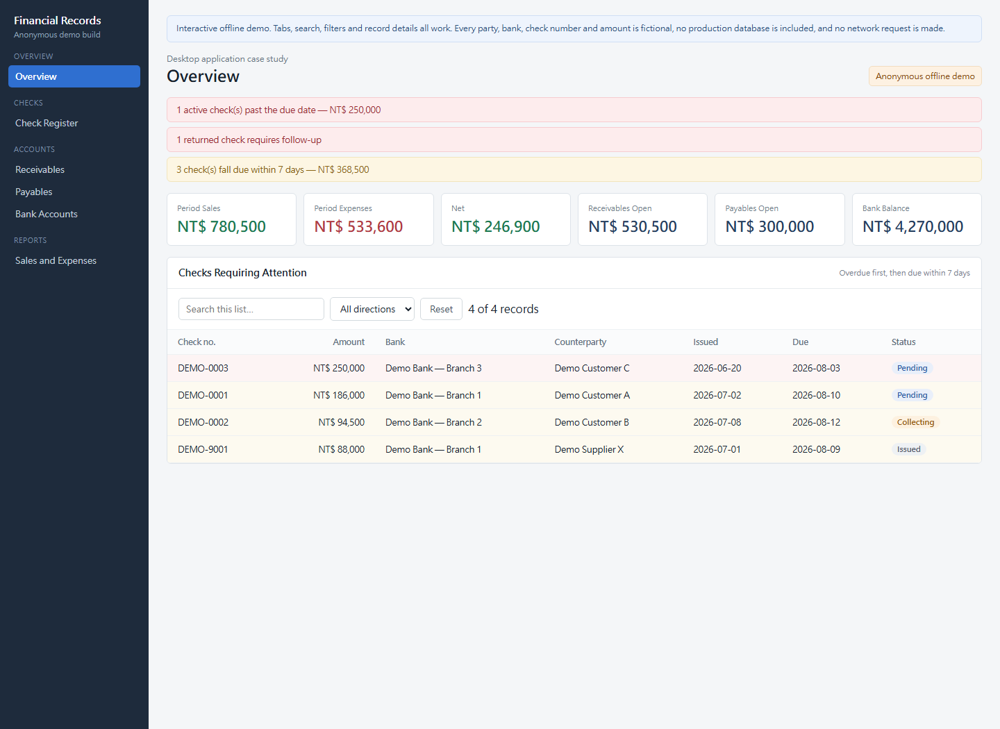
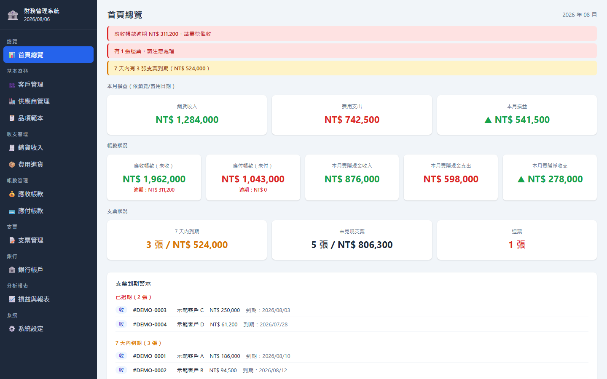
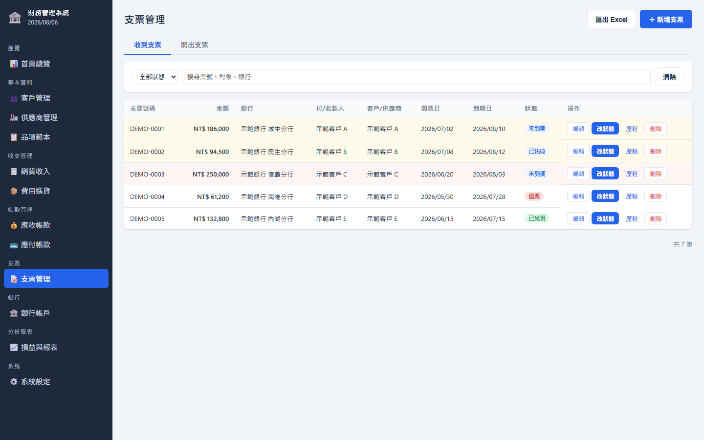
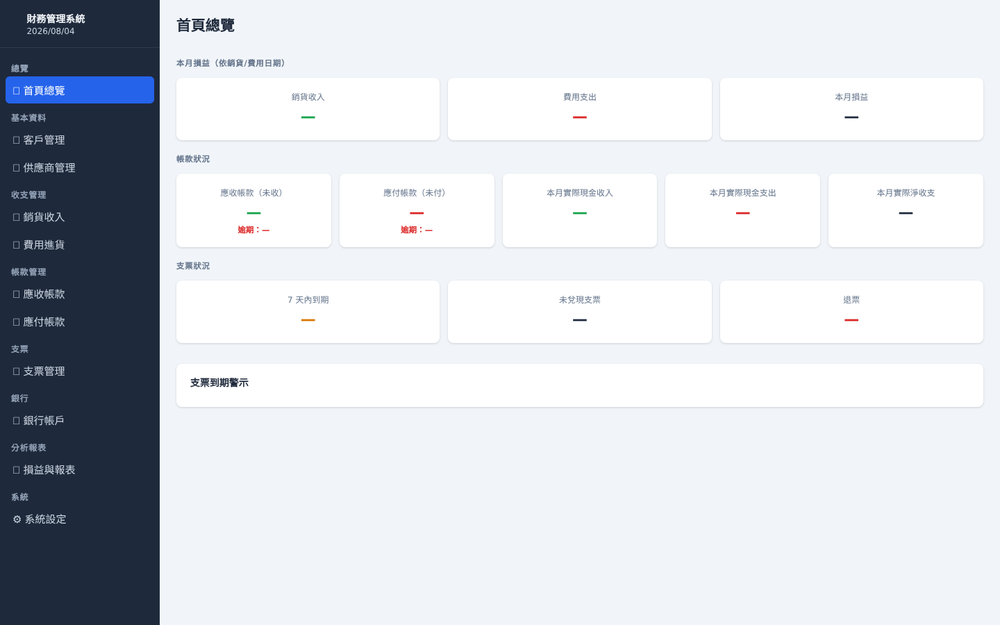

# Check Record System - Case Study

## Status

Under active development and being prepared for company use. The application source remains private while requirements and workflows are still evolving.

## Product Scope

- Incoming and outgoing check records
- Customers, suppliers, receivables, and payables
- Check due dates, clearing, collection, and return status
- Bank-account balance projections
- Sales, expenses, receipts, and payments
- Operational summaries and reports

## Technical Summary

The private desktop application uses Electron, JavaScript, SQLite, structured transactions, local data storage, and export workflows.

## Public Demo

Open `demo.html` for the interactive offline English demo. Navigation, the received/issued tabs, search, filters and record details all work; overdue and near-due checks are highlighted the same way the application highlights them. Every check, balance and party is fictional.

## Application Interface

The images below are the actual Electron desktop interface (Traditional Chinese), rendered offline with the database layer replaced by fictional checks, parties and balances:

| Overview | Check register |
|----------|----------------|
|  |  |

For reference, the same shell with an empty local database:

## Disclosure Boundary

No production database, financial record, company identity, bank information, or complete commercial source code is published.

